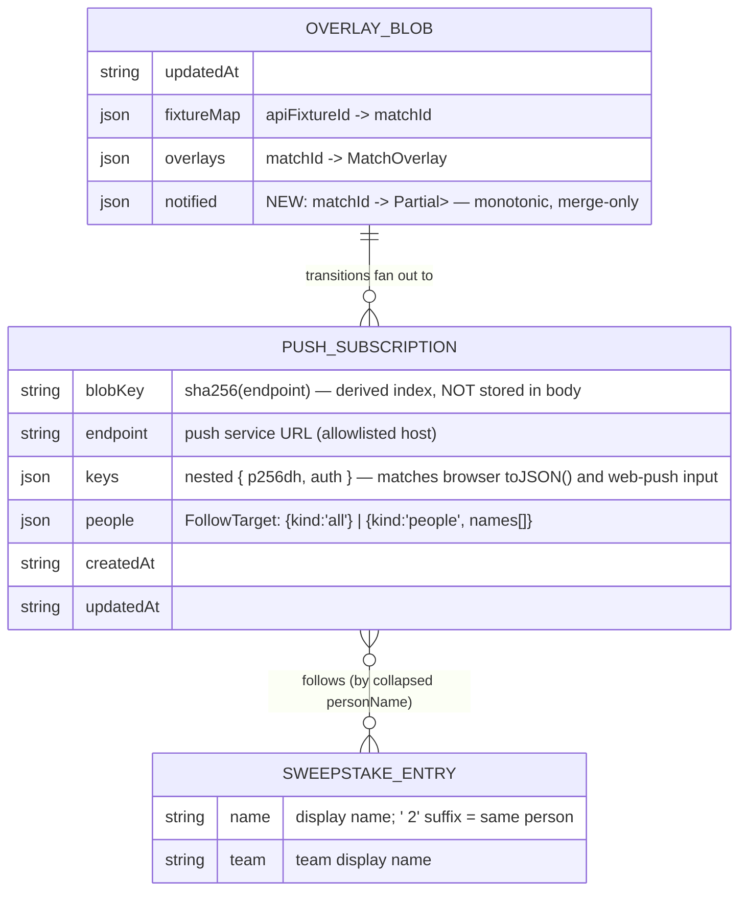

# ✨ Web Push notifications for fixture start and end

## Enhancement Summary

**Deepened on:** 2026-06-05 · **Agents:** architecture-strategist, security-sentinel, performance-oracle, code-simplicity-reviewer, kieran-typescript-reviewer, julik-frontend-races-reviewer, data-integrity-guardian, pattern-recognition-specialist, frontend-design

### Key corrections to the original draft
1. **The original at-most-once claim was wrong.** "Markers ride the overlay write" is not safe under overlapping runs — plain `setJSON` is last-write-wins, so two overlapping polls could both send *and* clobber each other's markers. Fixed: the overlay write is now a **compare-and-swap** (`getWithMetadata` etag → `setJSON({ onlyIfMatch })`, bounded retry with recompute); sends happen only for transitions whose marker write *won*.
2. **Transition detection moved out of `runPoll`.** A standalone pure `detectTransitions()` called from the orchestrator keeps the live-data path byte-identical to today and keeps all notification logic (and tests) in `notify.ts`.
3. **`/api/push` is the repo's first attacker-reachable mutating endpoint.** Added must-have hardening: push-service host allowlist (kills SSRF + third-party push amplification), payload size caps, Netlify per-path rate limiting, send-phase wall-clock budget, counts-only logging.
4. **Browser-side lifecycle was a happy-path sketch.** Added mandatory sequencing rules: permission-prompt-first gesture order (iOS), `serviceWorker.ready` timeout race, single in-flight operation gate, server-blob-as-source-of-truth, browser-unsubscribe-before-DELETE, SW-cached VAPID key.
5. **Type contracts pinned down before coding:** `FollowTarget` discriminated union (house `Selection` idiom), event-discriminated `MatchTransition` (score required on `ended`), shared wire types in `src/lib/push.ts` (dependency direction `netlify → src/lib` only), `MatchEvent` in `overlay.ts` to avoid a circular import, `// @ts-check` + WebWorker-lib tsconfig for `sw.js`.
6. **Cut per YAGNI review:** test-notification button (also an amplification door), Lighthouse-PWA criterion, focus-tab choreography; 5 phases → 4. Kept (overruling the simplicity pass, with reasons): the hook state union and on-mount re-sync — iOS does not reliably fire `pushsubscriptionchange`, so re-sync is the *primary* recovery there, not a backstop.
7. **New sections:** performance budget with numeric escalation tiers, retention/teardown plan, Alerts panel design spec.

---

## Overview

Add opt-in Web Push notifications to the sweepstake tracker. Visitors can subscribe to alerts for **one or more sweepstake participants** (or **everyone**), and receive a push when a followed person's team's fixture **kicks off** and when it **ends** (with the final score, including shootouts). Notifications name both teams and the people who hold them, e.g.:

> **⚽️ Kick-off: England vs USA**
> England (Lindsey Breeze) vs USA (Ian Turner)

> **🏁 Full-time: England 2–1 USA**
> England (Lindsey Breeze) 2–1 USA (Ian Turner)

Delivery is browser-native **Web Push** (service worker + Push API + VAPID) — no third-party service. Pushes are sent from the existing scheduled poller (`netlify/functions/poll-matches.mts`) when it detects status transitions in the live overlay. Subscriptions are stored in **Netlify Blobs**.

**Decisions made during refinement (2026-06-05):**
- Mechanism: **Web Push** (works with the site closed; installed-PWA support on mobile)
- Targeting: **multi-select of people + "everyone"** option
- Content: **kick-off announcement + final score at full-time** (not spoiler-free)

## Problem Statement

The site already polls football-data.org every 15 minutes during match windows and overlays live status/scores, but participants only see updates if they open the site. During a month-long tournament with up to 104 fixtures, people want to be told when *their* team (or their family's teams) kicks off and what the final score was — without watching the page.

## Proposed Solution

Four cooperating pieces, all following the repo's existing patterns (pure, dependency-injected lib functions + colocated Vitest tests):

1. **PWA foundation** — a plain-JS service worker and web app manifest served from the site root (via the repurposed `publicDir: 'data'`), handling `push`, `notificationclick`, and `pushsubscriptionchange`.
2. **Subscription API** — one new Netlify Function (`push.mts`) exposing the VAPID public key (GET), upsert subscription + followed-people (POST), and unsubscribe (DELETE). One blob per subscription in a new `push-subscriptions` store, keyed by SHA-256 of the endpoint. Hardened: host allowlist, size caps, rate limit.
3. **Opt-in UI** — an "🔔 Alerts" control in the masthead alongside the existing pickers, with a people multi-select, "everyone" option, iOS install guidance, and permission-state handling (full design spec in Phase 3).
4. **Transition detection + send** — a standalone pure `detectTransitions()` diffs prior vs next overlay status; `notified` markers are committed to the overlay blob via **compare-and-swap before sending** (true at-most-once); then `buildSendPlan()` + bounded-concurrency `web-push` fan-out, pruning dead subscriptions on 404/410 with conditional deletes.

### Architecture

```
                  ┌────────────────────────────────────────────────────────┐
                  │ poll-matches.mts (schedule: */5 during cup)            │
                  │  1. getWithMetadata(overlay) → prior + etag            │
                  │  2. runPoll(prior) → next blob          (unchanged)    │
                  │  3. detectTransitions(prior, next, static) → T[]       │
                  │  4. CAS write: setJSON(blob+markers, {onlyIfMatch})    │
                  │     └ miss → re-read, recompute, retry (≤3)            │
                  │  5. if T won: load subs (strong, parallel) →           │
                  │     buildSendPlan → web-push fan-out (conc 10,         │
                  │     5s/send timeout, ~20s wall budget)                 │
                  │     404/410 → conditional delete of subscription blob  │
                  │  ── steps 3-5 in their own try/catch: never break poll │
                  └──────┬─────────────────────────────┬───────────────────┘
                         │                             │
           Blobs: match-data/overlay     Blobs: push-subscriptions/<sha256(endpoint)>
                         │                             ▲
                         │                             │ POST/DELETE (allowlisted, rate-limited)
┌───────────┐  register  ┌──────────┐   subscribe  ┌───┴──────┐
│ React app │───────────▶│  sw.js   │◀─────────────│ push.mts │── GET vapid public key
│ (masthead │            │ push /   │   (browser   └──────────┘   (cached client-side + in SW)
│  Alerts)  │            │ click /  │    push svc)
└───────────┘            │ change   │
                         └──────────┘
```

#### Data model



> Store the **nested** `keys: { p256dh, auth }` shape — it is what `PushSubscription.toJSON()` produces and what `web-push.sendNotification` consumes; flattening would add a pointless transform. The blob key is derived, never duplicated into the body.

#### Key design decisions (and why)

| Decision | Choice | Rationale |
|---|---|---|
| Send location | Inline in the scheduled poller, bounded concurrency | Workplace-scale audience (tens of subs). ~200 sends ≈ 2–6 s at concurrency 10 with a 5 s per-send timeout — inside the 30 s scheduled cap. Numeric escalation tiers below. |
| Dedupe / exactly-once | `notified` markers in the overlay blob, committed via **CAS (`onlyIfMatch` etag) before sending** | Plain last-write-wins is *not* at-most-once under overlapping runs (both read no-marker → both send → one write clobbers the other's marker). CAS makes the marker write a real claim: send only what your write won. Markers are **monotonic and merge-only** — on CAS retry, merge with the fresh `prior.notified`, never overwrite from a stale snapshot. |
| Transition seam | Standalone `detectTransitions()` in `notify.ts`, called from `poll-matches.mts` | Keeps `runPoll`'s signature and the live-data path untouched (a stated non-functional goal); all notification logic + tests live in `notify.ts`; detection consumes the in-memory `prior` + `result.blob` already in scope — never a re-read of the just-written blob. |
| Subscription storage | One blob per subscription, key = `sha256(endpoint)` | Blobs are last-write-wins with no locking; per-key blobs mean concurrent subscribes never clobber each other. Endpoint is the natural unique ID. |
| Subscription reads | `store.list()` then **parallel chunked `get`s (concurrency ≥25) with `consistency: 'strong'`** — and only when `transitions.length > 0` | Serial strong reads are the silent budget killer (50 subs ≈ 2.5–4 s serial; ~0.2 s parallel). ~95% of in-window polls have zero transitions and must skip subscription I/O entirely. |
| VAPID public key to client | Runtime `GET /api/push`, cached client-side and **cached in the SW** | One source usable by the React app *and* `sw.js` (Vite doesn't process it — no `import.meta.env`); no secret-scanner allowlisting; key rotation needs no rebuild. The SW cache matters: `pushsubscriptionchange` can fire while offline, and without a cached key the re-subscribe is permanently lost. |
| Person identity | Collapsed display name via `personName()` (`src/lib/holders.ts:3`) | The only identifier that exists. Following "Kyle" expands server-side to both his teams (Australia + Saudi Arabia). |
| Targeting type | `FollowTarget` discriminated union, not `string[] \| 'all'` | Matches the house `Selection` idiom (`src/lib/highlight.ts`); `noFallthroughCasesInSwitch` polices every consumer; removes the "person literally named 'all'" ambiguity. |
| Service worker location | `data/sw.js` (+ manifest + icons) | `vite.config.ts:8` repurposes `publicDir` to `data/`, so files there land verbatim at the deploy root — exactly where a root-scoped SW must live. Netlify serves real files before the `/*` SPA redirect, so no redirect change needed. |
| Source of truth | **Server blob = delivery truth; browser `PushSubscription` = channel truth; localStorage = hint only** | Two stores with no declared master is the root cause of silent divergence. Every write path persists the localStorage hint only *after* the server POST resolves. |
| Poll cadence | Tighten `*/15` → `*/5` for the tournament — shipped in Phase 1, separately from push | Caps kick-off latency at ~5 min; still 1 API request per poll (free tier allows 10/min). Shipping it early isolates a user-visible live-data change from the experimental push feature. |

#### Shared type contracts (decide once, here)

Dependency direction is **`netlify → src/lib` only** (already established — `overlay.ts` imports `Match` from `src/lib/types`). The app must never import from `netlify/`.

```ts
// src/lib/push.ts  (NEW — shared wire contract, DOM-free)
export type FollowTarget = { kind: 'all' } | { kind: 'people'; names: string[] }

export interface PushSubscriptionWire {
  endpoint: string
  keys: { p256dh: string; auth: string }
}

export interface SubscribeRequest {
  subscription: PushSubscriptionWire
  people?: FollowTarget   // absent on SW-driven re-subscribe → server preserves stored target
  oldEndpoint?: string    // present on rotation → server migrates people + deletes old blob
}

export interface PushPayload {
  title: string
  body: string
  tag: string             // "<matchId>-<event>"
  data: { url: string }   // url under data — notificationclick reads event.notification.data
}
```

```ts
// netlify/functions/lib/overlay.ts  (additions — overlay.ts stays the lowest layer; notify.ts imports
// from it, never the reverse, avoiding the overlay↔notify circular-import trap)
export type MatchEvent = 'started' | 'ended'
export interface OverlayBlob {
  /* existing fields */
  notified?: Record<string, Partial<Record<MatchEvent, string>>> // matchId → event → ISO timestamp
}
```

```ts
// netlify/functions/lib/notify.ts
export type TeamRef = { slug: string } | { placeholder: string } // resolved vs unresolved knockout side

export type MatchTransition =
  | { event: 'started'; matchId: string; home: TeamRef; away: TeamRef }
  | { event: 'ended'; matchId: string; home: TeamRef; away: TeamRef
      score: { home: number; away: number }
      shootout?: { home: number; away: number } }
// Discriminated on event: 'ended' always has a score — compile-time, no `score!` in the copy builder.

export function detectTransitions(
  prior: OverlayBlob | null,           // whole blob: needs .overlays AND .notified for the dedupe rule
  next: OverlayBlob,
  staticMatches: Match[],
): MatchTransition[]

export function buildSendPlan(
  transitions: MatchTransition[],
  subscriptions: StoredSubscription[],
  sweepstake: SweepstakeEntry[],
  teams: Team[],
): Send[]                              // { subscription, payload: PushPayload }
```

```ts
// netlify/functions/lib/subscriptions.ts (server-only)
export interface StoredSubscription extends PushSubscriptionWire {
  people: FollowTarget
  createdAt: string
  updatedAt: string
}
export function parseSubscribeRequest(input: unknown): SubscribeRequest | null // typed home for validation
```

Runtime imports across the boundary: extract `highlightSlugs`-equivalent slug logic and `personOptions` into `src/lib/holders.ts` (DOM-free) so functions never import a module that names `localStorage` (`highlight.ts` does). `buildSendPlan` uses `name`/`team` only; `emoji` (Slack codes) is intentionally ignored — names already carry display emoji like `Moomin 😸`.

#### Transition rules (each one is a unit test in `notify.test.ts`)

- `prevStatus = prior?.overlays[id]?.status ?? 'scheduled'` — scheduled matches aren't recorded in the overlay (`poll.ts:82`), so an absent prior **is** `scheduled`. First observation of `live` therefore correctly fires `started` (latency bounded by poll cadence + the kickoff→+3.5 h active window).
- `started` fires when `prevStatus === 'scheduled' && next === 'live'`.
- `ended` fires when `prevStatus !== 'finished' && next === 'finished'`.
- **`scheduled → finished` jump (poll gap missed the live phase): fire only `ended`.** A kick-off announcement for a finished match is misleading.
- A transition whose event already has a `notified` marker in `prior.notified` is dropped — the dedupe rule lives *inside* `detectTransitions` so it stays pure and testable.
- Team matching uses **resolved overlay slugs**, falling back to the static match's slugs when the static side is a real team (group stage). An unresolved knockout side is a `{ placeholder }` `TeamRef`: matches no follower; renders as the static placeholder text with no holder name. *(Realistic frequency note: `transform.ts` resolves sides from the same fixture payload that flips status, so sides are typically resolved by the time `started` fires — this is an edge-case test, not a major code path.)*

#### Send plan payload copy

- started — title `⚽️ Kick-off: England vs USA`, body `England (Lindsey Breeze) vs USA (Ian Turner)`
- ended — title `🏁 Full-time: England 2–1 USA`, body `England (Lindsey Breeze) 2–1 USA (Ian Turner)`; shootout appends ` — England win 4–2 on penalties`
- Unheld/unresolved side: name only, no parenthetical. Holder names are display names verbatim (`Moomin 😸` must round-trip).
- `tag: "<matchId>-<event>"` (client-side replacement = defence-in-depth against dupes), `data: { url: '/' }` — **url stays server-fixed**; if deep-linking is ever added, never derive it from subscription-supplied data (open-redirect guardrail).
- Send options: `TTL: 3600`, `urgency: 'high'` — a stale kick-off alert shouldn't arrive hours later.

### Security hardening (`/api/push` is the repo's first attacker-reachable mutating endpoint)

**Must-have:**
1. **Endpoint host allowlist** — reject POST unless `endpoint` parses as `https:` AND its hostname suffix-matches known push services (`fcm.googleapis.com`/`*.googleapis.com`, `*.push.services.mozilla.com`, `*.notify.windows.com`, `*.push.apple.com`). Neutralises SSRF (internal/metadata addresses) *and* third-party push amplification (our poller POSTing at attacker-chosen URLs). Lives in `parseSubscribeRequest`, covered in `subscriptions.test.ts`.
2. **Payload bounds** — body ≤ ~4 KB; `endpoint` ≤ 1 KB; `p256dh`/`auth` base64url within expected lengths (~88/~24 chars); `people.names` length ≤ distinct-person count (~40), each a bounded string validated against `sweepstake.json` (collapsed names).
3. **Rate limit** — Netlify per-path rate limiting on `/api/push` in `netlify.toml` (low per-IP rate). Highest-leverage control, zero code.
4. **Send-phase wall-clock budget** — stop initiating new sends after ~20 s and log the remainder, so an inflated subscriber set degrades gracefully instead of threatening the 30 s cap (which would kill *overlay updates*, not just pushes).
5. **Counts-only logging** — never log endpoints, key material, blob keys, or holder names. `auth`/`p256dh` are secrets; an endpoint+keys pair is a *capability to push to that device*.

**Documented non-issues:** CSRF needs no token — no auth/cookie state exists, so a forged request can only register the victim's own real subscription. The store has no list/read API (invariant, enforced by test: GET returns only the public key).

### Data-integrity rules (Netlify Blobs reality)

1. **Overlay write is CAS:** `getWithMetadata(BLOB_KEY, { type: 'json' })` → compute → `setJSON(blob, { onlyIfMatch: etag })` (`onlyIfNew: true` when prior was null). On CAS miss: re-read, recompute transitions against the now-current `notified`, retry (≤3). A transition lost to a competing writer this cycle is **not sent** this cycle — the winner owns it.
2. **`notified` is monotonic and merge-only** — markers are only ever added during the tournament; never cleared, never overwritten from a stale in-memory copy. Bounded: ≤104 matches × 2 events ≈ 6 KB. Document in `overlay.ts` that `mergeMatches` reads fields by name (never spreads the blob into the response) — that invariant is what keeps `notified` out of `/matches.json`, backed by a test.
3. **Prune is a conditional delete:** capture each subscription blob's etag when loading the send plan; on 404/410, `delete` guarded by that etag (skip if changed). Protects the re-subscribe race: a browser re-POSTing the same endpoint between send and prune must not be silently unsubscribed. Missing-blob-on-delete is success, not an error. Prunes run via `allSettled`, never serialized in the hot path.
4. **Mid-tournament `sweepstake.json` edits:** stored names that no longer resolve are **skipped at send time — the blob is never rewritten or deleted** on resolve failure (an organiser typo must not mass-unsubscribe).
5. **Orphan directions, both named:** (a) browser subscribed but POST failed → no server blob → re-sync-on-mount is the recovery; UI treats "browser has sub but server doesn't" as not-subscribed and re-POSTs. (b) server blob but browser sub gone → self-heals via 410-prune *only when a send is attempted*; dormant orphans are mopped up by the post-tournament purge (below).

### Frontend & service-worker lifecycle rules (mandatory sequencing)

1. **Gesture order (iOS-safe):** in the click handler, call `Notification.requestPermission()` **first, synchronously in the gesture** — awaiting `serviceWorker.ready` before it can break WebKit's gesture association and silently suppress the prompt. Then await `ready`, then `pushManager.subscribe`.
2. **`serviceWorker.ready` never rejects** — a failed registration means it hangs forever. Always race it against a timeout (generous, ~10 s — cold iOS standalone launches are slow) and treat timeout as an error state with retry copy. Registration itself kicks off once on mount (cheap), so `ready` has a head start by click time — but the handler never assumes it finished.
3. **Single in-flight operation gate:** the hook state union includes a `subscribing` (busy) state; every action (`subscribe`, `updatePeople`, `unsubscribe`, mount re-sync) refuses entry unless idle, resets in `finally`, and all buttons are `disabled` while busy. Kills double-click double-subscribes, edit-during-re-sync clobbers, and unsubscribe-during-update interleaving.

   ```ts
   type PushState =
     | { kind: 'unsupported' }
     | { kind: 'ios-needs-install' }
     | { kind: 'idle'; permission: NotificationPermission } // reuse the platform type
     | { kind: 'subscribing' }
     | { kind: 'subscribed'; target: FollowTarget }          // carries current selection
     | { kind: 'error'; message: string }
   ```
   The transition function is pure (`reduce(state, action): PushState`) and unit-tested; `navigator`/`fetch` effects stay in the hook (the `useTournament` thin-hook idiom).
4. **Re-sync on mount (primary recovery on iOS, where `pushsubscriptionchange` is unreliable):** runs **once**, guarded by a `useRef` (React 19 StrictMode double-invokes effects in dev), through the op gate, with effect-cleanup cancellation. Logic: `getSubscription()` → if present, idempotent upsert to the server with localStorage prefs as the user's intent. Don't gate on "browser sub missing" — gate on "haven't confirmed server has this endpoint+prefs this session" (catches the pruned-server-blob-while-browser-sub-lives case).
5. **Unsubscribe order: browser `unsubscribe()` first, then server DELETE**, clearing the localStorage hint between. If DELETE fails the dead blob is harmless (410-prunes on next send). The reverse order is worse: a failed browser unsubscribe + deleted blob gets *resurrected* by re-sync on next visit.
6. **SW caches the VAPID key:** `pushsubscriptionchange` can fire the moment a flaky network returns; its re-subscribe **requires** the key bytes and a failed fetch loses the rotation forever. The SW caches the `GET /api/push` response (Cache API) on first successful fetch; the event handler reads cache-first with network as refresh, entire chain inside `event.waitUntil()`. No cached key + fetch fails = accepted unrecoverable case (re-sync-on-mount heals it next visit) — comment this in the SW.
7. **Rotation must not downgrade the selection:** the SW doesn't know the people-list (it can't read localStorage). Its re-subscribe POST sends `{ subscription, oldEndpoint }` with **no `people` field** → server migrates the stored `FollowTarget` from the old blob to the new key and deletes the old blob (fixes silent-downgrade *and* orphaned-old-endpoint in one move). Feature-detect `event.oldSubscription` (often null on WebKit); fall back to `pushManager.getSubscription()`.
8. **Accepted residual risk (documented, not engineered away):** cross-device/tab write reordering under last-write-wins per endpoint. A per-write `clientSeq` rejected-if-stale scheme exists as hardening if this ever bites; out of scope for a 4-week site.

## System-Wide Impact

- **Interaction graph**: poller → `runPoll` (unchanged) → `detectTransitions` → CAS overlay write (now includes `notified`) → subscription list read (strong, parallel, only if transitions) → web-push fan-out → conditional 404/410 prune. Frontend: click → permission → SW ready → subscribe → POST → blob write → localStorage hint.
- **Error propagation — three distinct failure zones:**
  - **Zone 1 (poll integrity):** overlay+marker CAS write. If this fails after retries, abort the push section — but the function must still behave as today for live data. VAPID misconfig is detected in `webPush.ts`, which returns a **no-op sender** (log-and-skip) — unlike `FOOTBALL_DATA_TOKEN`, which legitimately throws (`poll.ts:50`).
  - **Zone 2 (sends):** subscription read + fan-out — wrapped, logged, swallowed. A send failure loses that notification (at-most-once, accepted).
  - **Zone 3 (prunes):** each conditional delete independent via `allSettled`; a failed delete just retries on a future send.
- **State lifecycle risks**: covered by the integrity + lifecycle rules above; "alerts apply to this device" by design (two devices = two independent subscriptions).
- **API surface parity**: `/matches.json` consumers unaffected — `notified` lives only in the blob; `mergeMatches` ignores it (tested). The frontend 5-min refresh loop (`useTournament.ts`) is unchanged and complementary.
- **Integration test scenarios**: simulated multi-poll sequences (scheduled → live → finished; scheduled → finished jump; overlapping-run CAS contention; 410 prune + re-subscribe race) — see Phase 4.

## Technical Approach

### Implementation Phases

#### Phase 1 — PWA foundation (SW + manifest) + cadence

Files:
- `data/sw.js` *(new, plain JS with `// @ts-check`)*
  - `push`: **defensively parse** (`event.data?.json()` in try/catch — a malformed payload must not throw unhandled in the SW), `event.waitUntil(showNotification(...))` using the `PushPayload` shape
  - `notificationclick`: close → `clients.matchAll({ type: 'window', includeUncontrolled: true })` → focus first client else `openWindow('/')` (no per-URL matching choreography — single-route SPA)
  - `pushsubscriptionchange`: per lifecycle rules 6–7 (cache-first VAPID key, `oldEndpoint` migration POST, whole chain in `waitUntil`)
- `tsconfig.sw.json` *(new)* — `lib: ["ESNext", "WebWorker"]`, `checkJs`, `noEmit`, `types: []`, `include: ["data/sw.js"]`; referenced from root `tsconfig.json`. **Exclude `data/sw.js` from `tsconfig.app.json`** — under the app's `DOM` lib, `self` is a `Window` and every SW type is wrong. Payload typed via JSDoc cast to `import('../src/lib/push').PushPayload`.
- `data/manifest.webmanifest` *(new)* — `name: "World Cup 2026 Sweepstake"`, `short_name`, `display: "standalone"`, `start_url: "/"`, theme/background colours from the default theme, icon 192 (+512 if trivial). Scope is "enough for iOS Add-to-Home-Screen + a notification icon" — not a Lighthouse PWA badge.
- `data/icons/icon-192.png` *(new — rasterised from the existing inline SVG favicon)*
- `index.html` — `<link rel="manifest" href="/manifest.webmanifest">` + `apple-mobile-web-app-*` metas
- `netlify.toml`:
  ```toml
  [[headers]]
    for = "/sw.js"
    [headers.values]
      Cache-Control = "no-cache"
  ```
- `netlify/functions/poll-matches.mts:42` — schedule `*/15 * * * *` → `*/5 * * * *` (independent of push; shipping early isolates this live-data change)

Success criteria: SW served as JS (not the SPA fallback HTML) in prod and `netlify dev`; site installable on iOS/Android; `tsc -b` type-checks the SW under the WebWorker lib.

#### Phase 2 — Subscription backend

Files:
- `src/lib/push.ts` *(new)* — the shared wire types above
- `netlify/functions/push.mts` *(new, Functions v2, `config = { path: '/api/push' }`)*
  - `GET` → `{ publicKey }` (from `VAPID_PUBLIC_KEY` env)
  - `POST` → `parseSubscribeRequest` (allowlist + bounds + people validation) → upsert; `people` absent → preserve stored target; `oldEndpoint` present → migrate target + delete old blob
  - `DELETE` body `{ endpoint }` → delete blob (idempotent)
  - No auth (public low-stakes site), but: never lists/returns stored subscriptions; accepts/deletes only the caller's own subscription object
- `netlify/functions/lib/subscriptions.ts` *(new)* — store constant `push-subscriptions`, `endpointKey()` (SHA-256 via `node:crypto`), `StoredSubscription`, `parseSubscribeRequest`, and the **list+hydrate helper: `list()` → parallel chunked `get`s (concurrency ≥25) with `{ consistency: 'strong' }`, returning values with etags** (Phase 4 only orchestrates)
- `netlify/functions/lib/subscriptions.test.ts` *(new)* — key derivation; allowlist accepts FCM/Mozilla/Apple/WNS endpoints and rejects `http:`, internal IPs, arbitrary hosts; size caps; unknown-people rejection; `{ kind: 'all' }`; people-absent preserve; oldEndpoint migration
- `netlify.toml` — rate-limit config for `/api/push`
- Env vars (mirror `FOOTBALL_DATA_TOKEN` handling): `VAPID_PUBLIC_KEY`, `VAPID_PRIVATE_KEY` (functions scope, secret), `VAPID_SUBJECT` (`mailto:`). Generate once with `npx web-push generate-vapid-keys`; set via `netlify env:set`. Rotating keys invalidates every subscription (document in README, and use deliberately at teardown).
- `package.json` — add `web-push` to **`devDependencies`** (matches `@netlify/*` placement; Netlify bundles from devDeps). Pure JS, bundles cleanly. If its types don't resolve under the functions tsconfig, a one-line `declare module 'web-push'` ambient under `netlify/`.
- `tsconfig.functions.json` — already has `resolveJsonModule` and `include: ["netlify"]` covers the new files; no change expected.

Success criteria: full POST/GET/DELETE loop against `netlify dev` with a real browser subscription; allowlist and caps proven by tests.

#### Phase 3 — Opt-in UI

Files:
- `src/lib/pushPrefs.ts` *(new)* — localStorage hint (key `push-prefs`), **`themes.ts`-style type guard on load** (not a bare cast) for `{ enabled: boolean; target: FollowTarget }`; written only after server POST resolves
- `src/lib/holders.ts` — extract/centralise `personOptions` + person→slug expansion (DOM-free, shared with functions)
- `src/usePushNotifications.ts` *(new hook, `src/` root per `useTournament.ts` convention)* — the `PushState` union + pure tested reducer + lifecycle rules 1–5; lazy concerns: SW registration kicked off on mount (cheap), everything else on gesture; VAPID key cached in memory after first GET
- `src/components/AlertsPanel.tsx` *(new)* — per the design spec below
- `src/App.tsx` — mount; masthead layout adjustments
- Tests: `pushPrefs.test.ts`, reducer tests

**Design spec (condensed from frontend-design review — first popover in the codebase; divergence justified: multi-select + multi-state flow can't be a native `<select>`. Minimise new surface: native `<button>` trigger, native checkboxes, no library):**

- **Trigger:** a third masthead pill `🔔 Alerts` cloning the `.theme-toggle` recipe (2.2 rem, `border-radius: 999px`, `var(--bg-raised)`/`var(--line)`). States: plain (off) / 6 px `var(--accent)` dot (subscribed) / `var(--danger)` dot (denied). `aria-haspopup="dialog"`, `aria-expanded`. **Masthead layout must be planned, not assumed:** controls are absolutely positioned and already collide at the 560 px breakpoint where `.highlight-picker` goes static — group the Alerts pill into that same reflowing cluster (`styles.css:118-126`).
- **Panel:** `var(--bg-raised)` card, `var(--radius)`, `var(--line)` border, the existing easter-egg popover shadow (`0 8px 24px rgb(0 0 0 / .45)`). ≥560 px: anchored popover under the trigger, `min(20rem, calc(100vw - 1.5rem))`. <560 px: fixed bottom sheet (top-rounded, slide-up, scrim via `color-mix(in srgb, var(--bg) 70%, transparent)` + blur, matching `.is-stuck`). `role="dialog"` `aria-modal`, focus trapped, `Esc`/outside-click closes, focus returns to trigger.
- **Anatomy:** header `🔔 Match alerts` + one-line explainer → segmented "Everyone | Selected people" (two `role="radio"` buttons styled as `.view-tabs button`, active = accent fill) → when "Selected": filter input (`🔍`, pill-styled) + **two-column scrollable checkbox grid** (`max-height ~13rem`, `var(--bg-inset)` recess, `overscroll-behavior: contain`, full-row `<label>` targets, `.team-name`-style ellipsis for long names, `accent-color: var(--accent)` for zero-JS themed checkboxes) + "3 selected · Clear" line (doubles as `aria-live` feedback) → full-width CTA (`.app-state button` recipe) → footnote.
- **State microcopy:** *idle/default* CTA "Turn on alerts"; *subscribed* accent-wash banner "Alerts are on for this device", CTA becomes "Update" only when dirty, plus a `var(--danger)` "Stop alerts" link-button; *ios-needs-install* replaces controls with 3-step Add-to-Home-Screen instructions; *denied* gold `.warning` banner "Alerts are blocked for this site — allow notifications in your browser's site settings, then reload" (no re-prompt button — it's a false affordance); *unsupported* → pill not rendered; *error* → message + retry. Footnote: "Alerts apply to this device. We store your push subscription only to send these match alerts."
- **Motion:** one-shot bell ring on open (~450 ms) and sheet slide-up, both gated by `prefers-reduced-motion`. No new tokens, no new colours, no library.

Success criteria: full subscribe→edit→unsubscribe loop in Chrome + Android; iOS installed-PWA path verified on a real device; denied + error states show recovery copy; double-click produces exactly one POST.

#### Phase 4 — Transition detection + sending

Files:
- `netlify/functions/lib/overlay.ts` — `MatchEvent` + `notified` (merge-only invariant documented)
- `netlify/functions/lib/notify.ts` *(new, pure)* — `detectTransitions` + `buildSendPlan` per the contracts above
- `netlify/functions/lib/notify.test.ts` *(new)* — the rule table: scheduled→live; live→finished; scheduled→finished jump (end only); absent-prior→live fires started; finished never re-fires; notified-marker suppression; unresolved knockout side; Kyle two-team expansion; `Moomin 😸` round-trip; both-sides-followed → one notification; `{ kind: 'all' }`; shootout copy; one-side-held copy
- `netlify/functions/lib/webPush.ts` *(new — thin, but earning its keep with three jobs)*: narrow interface `sendOne(sub, payload): Promise<{ statusCode: number }>` over `web-push` (`setVapidDetails`, `sendNotification` with `{ TTL: 3600, urgency: 'high' }`); **per-send `AbortController` timeout (~5 s)** — the single most likely cause of an unexplained cap-blow is one hung push endpoint; **VAPID-absent → no-op sender** (log-and-skip) so `poll-matches.mts` stays declarative
- `netlify/functions/poll-matches.mts` — orchestrate per the architecture box: CAS write → (if won + transitions) load subs → plan → fan out (concurrency 10–20, `Promise.allSettled` chunks, ~20 s wall budget) → conditional prunes. Push section (zones 2–3) in its own try/catch.
- `netlify/functions/lib/merge.test.ts` — `mergeMatches` ignores `notified` (Phase 4 acceptance, not just a quality gate)
- **Instrumentation (acceptance criterion):** every poll that sends logs `reads=Xms sends=Yms total=Zms subs=N sent=M pruned=K` — counts and timings only, never endpoints/keys/names. This turns the escalation tiers below into observed triggers.

Success criteria: simulated poll sequences produce exactly one `started` + one `ended` per matching subscription; re-running a poll sends nothing; CAS-contention test (two writers, one prior) shows single-send; 410 prunes conditionally; a hung send times out without breaching the wall budget.

### Performance budget & escalation tiers

Worst case = 4 simultaneous group-stage kickoffs, audience skewed to "everyone":

| Subs | Parallel strong reads | Sends (4 matches) | Wall-clock | Verdict |
|---|---|---|---|---|
| 50 | ~0.2 s | ~200 → 2–6 s | **~2–7 s** | Comfortable — plan as-is |
| 200 | ~0.6 s | ~800 → 8–24 s | **~9–25 s** | Marginal — needs concurrency ≥20 + per-send timeout |
| 1000 | ~3 s | ~4000 → 40 s+ | **over cap** | Must escalate |

Numbered escalation triggers (observed via the instrumentation log, not guessed):
1. **~150 subs:** raise send concurrency to ~20 (already have the 5 s per-send timeout).
2. **~250 subs, or any poll logging >18 s total:** move the fan-out to a **background function** (15 min cap) — mechanical, since `buildSendPlan` is already a pure step the poller can hand off after committing markers.
3. **~1000 subs:** switch reads to metadata-only `list({ metadata: true })` (a subscription fits the ~2 KB metadata limit) — collapses the read phase to one round trip.

### Alternative Approaches Considered

- **Third-party push service (OneSignal/FCM)** — rejected during refinement: external dependency + SDK for a hobby site.
- **In-app Notification API only** — rejected: no notifications when the site is closed, which is the entire point.
- **Background function for sends** — deferred behind numeric trigger #2 above.
- **One aggregate subscriptions blob** — rejected: last-write-wins clobbering between concurrent subscribers.
- **`VITE_VAPID_PUBLIC_KEY` build-time inlining** — rejected: the SW can't read Vite env; secret-scanner friction; runtime GET is one source of truth.
- **Dedicated "sent log" blob** — rejected: a second blob adds a second race; CAS on the overlay blob is the correct primitive.
- **"Send test notification" button** — cut (YAGNI + it's a self-send branch on an unauthenticated endpoint). For ~tens of known colleagues, "tell me if you didn't get the England alert" is a Slack message. If ever added: it must target only the caller's own stored subscription, never a request-supplied endpoint.
- **`clientSeq` ordered-write rejection** — documented as available hardening; accepted residual risk instead (4-week lifespan).

## Acceptance Criteria

### Functional
- [x] Visitor can opt in from the masthead; permission requested only on click, **before** any awaits (gesture-safe order)
- [x] Visitor can follow one or more people (deduped names — "Kyle" once) or everyone, and edit the selection later; double-click/rapid actions produce exactly one in-flight operation
- [x] Following a person covers **all** their teams (incl. " 2" second entries)
- [x] `started` fires on scheduled→live naming both teams and holders; `ended` fires on →finished with final score (+ shootout)
- [x] scheduled→finished poll jump produces **only** `ended`
- [x] No duplicate sends for the same (match, event) — including under simulated overlapping polls (CAS contention test)
- [x] Unsubscribe: browser `unsubscribe()` first, then DELETE; control returns to opt-in state; failed DELETE self-heals via prune
- [x] Dead subscriptions pruned via **conditional** delete; a re-subscribed endpoint is never pruned by a stale 410
- [x] Subscription rotation (`pushsubscriptionchange`) preserves the user's people-selection and removes the old blob (`oldEndpoint` migration)
- [x] Orphan recovery both directions: POST-failed-after-subscribe → healed by re-sync on next visit; pruned-server-blob-while-browser-sub-lives → healed by re-sync upsert
- [ ] iOS Safari (not installed) shows Add-to-Home-Screen guidance; installed PWA receives pushes on a real device
- [x] Permission-denied state shows recovery guidance (no fake re-prompt button)
- [ ] `Moomin 😸` renders correctly in a delivered notification
- [x] Knockout match with one unresolved side notifies followers of the resolved side; unresolved side shows placeholder text without a holder

### Security
- [x] POST rejects non-HTTPS and non-allowlisted-host endpoints (tested for FCM/Mozilla/Apple/WNS accept + internal-IP/arbitrary-host reject)
- [x] Payload size/length/cardinality caps enforced and tested
- [ ] `/api/push` rate-limited — Netlify rate limiting is a dashboard feature, not `netlify.toml`; enable under Site configuration → Security (ops follow-up)
- [ ] No code path lists or returns stored subscriptions (invariant test: GET returns only the public key)
- [x] Logs contain counts/timings only — never endpoints, keys, blob keys, or holder names

### Non-functional
- [x] Push failures never prevent the overlay write or abort the poll; VAPID misconfig degrades to a logged no-op
- [x] Poll (incl. sends) stays inside the 30 s cap at expected scale: parallel chunked strong reads, 5 s per-send timeout, ~20 s send wall budget, zero subscription I/O when no transitions
- [x] VAPID private key only in Netlify env (functions scope); never bundled, logged, or committed
- [ ] `/sw.js` served with `Cache-Control: no-cache` and correct MIME (not the SPA fallback)
- [x] `sw.js` type-checks under the WebWorker lib (`tsconfig.sw.json`); excluded from the app tsconfig

### Quality gates
- [x] All new lib logic covered by colocated Vitest tests — `prebuild` runs the suite, so this gates deploy
- [x] `mergeMatches` proven to ignore `notified` (Phase 4 acceptance)
- [x] Phase-timing instrumentation log present
- [x] README updated: VAPID setup, env vars, organiser runbook, latency expectations ("around kick-off, within ~5 minutes"), teardown steps

## Success Metrics

- Kick-off alerts within one poll interval (≤ ~5 min) of the API reporting `IN_PLAY`
- Zero duplicate notifications across the tournament (spot-check logs)
- Zero poll failures attributable to the push layer
- Instrumentation logs confirm send-phase wall-clock well under budget at observed subscriber counts

## Dependencies & Risks

| Risk | Impact | Mitigation |
|---|---|---|
| iOS requires installed PWA (16.4+); `pushsubscriptionchange` unreliable on WebKit; SW killed aggressively | iOS users think it's broken; rotations silently lost | Detect-and-instruct sub-flow; re-sync-on-mount as the *primary* iOS recovery; everything in `waitUntil`; generous `ready` timeout |
| Overlapping scheduled runs | Double sends / lost markers | CAS overlay write (`onlyIfMatch`) + send-only-what-you-won + `tag` defence-in-depth |
| Abuse of unauthenticated `/api/push` | SSRF, push amplification, store flooding, cap blow-out | Host allowlist, size caps, rate limit, send wall budget |
| football-data free tier delays status changes | Late notifications | UI copy sets expectations; `*/5` cadence caps added latency |
| Blob eventual consistency (~60 s) | Stale subscription reads | Strong-consistency reads in the send path (parallelised — strong must never mean serial) |
| `web-push` lib maintenance-mode (last release 2023) | Future breakage | Pure JS, stable protocol (RFC 8291); `@block65/webcrypto-web-push` is the identified drop-in |
| Audience growth | 30 s cap pressure | Numeric escalation tiers, triggered by observed instrumentation, not guesses |
| `sweepstake.json` edited mid-tournament | Stored name no longer resolves | Skip at send; never rewrite/delete the blob on resolve failure |

## Retention & teardown (post-tournament)

After the final, `inActiveWindow` is false forever → no sends → **no more 410 pruning** → every subscription blob would live forever. Plan:
1. **Dated teardown step in the README runbook** (final + ~7 days): delete the `push-subscriptions` blob store (also the backstop for dormant orphans that never self-pruned), and retire/rotate the VAPID keys — rotation permanently neutralises any outstanding browser subscriptions even if a blob lingered.
2. DELETE-by-endpoint is the per-user erasure mechanism during the tournament; the store purge is the guaranteed catch-all.
3. Stated at-rest posture (conscious decision): subscription blobs (endpoint + p256dh/auth + people) sit unencrypted in Netlify Blobs; mitigations are short retention, no-list API, counts-only logging, and the dated purge.

## Future Considerations

- Goal-by-goal score alerts (needs finer polling + per-score dedupe keys — `MatchEvent` union extends naturally)
- Per-stage filtering ("knockouts only") if "everyone" proves a firehose (104 × 2 notifications)
- Deep-linking `notificationclick` to a match — **must keep the URL server-built, never subscription-derived** (open-redirect guardrail)
- `clientSeq` write-ordering if cross-device edit races ever bite

## Sources & References

### Internal
- Poller & transition seam: `netlify/functions/lib/poll.ts:65-85`; orchestrator + unconditional write to convert to CAS: `netlify/functions/poll-matches.mts:27,38,42`
- Overlay model: `netlify/functions/lib/overlay.ts:26-45`; merge reads-by-name invariant: `netlify/functions/lib/merge.ts:14-25`
- Status mapping: `netlify/functions/lib/transform.ts:6-13`, `netlify/functions/lib/footballData.ts:24-34`
- Person↔team: `src/lib/holders.ts:3,7`, `src/lib/highlight.ts:35-49`, `data/sweepstake.json`
- UI/persistence patterns: `src/App.tsx:43-128` (pickers), `src/lib/highlight.ts:9-32` + `src/lib/themes.ts` (guarded localStorage), `src/useTournament.ts` (thin hook), `src/styles.css:77-127,118-126,154-188` (masthead/pills/tabs)
- publicDir wrinkle: `vite.config.ts:8`; SPA redirect: `netlify.toml:18-21`; tsconfig boundary: `tsconfig.app.json`, `tsconfig.functions.json`
- Prior plan (live-data design, rate-limit notes): `docs/plans/2026-06-04-001-feat-world-cup-sweepstake-tracker-plan.md`

### External
- web-push library: https://github.com/web-push-libs/web-push (WebCrypto alternative: https://github.com/block65/webcrypto-web-push)
- MDN `pushsubscriptionchange`: https://developer.mozilla.org/en-US/docs/Web/API/ServiceWorkerGlobalScope/pushsubscriptionchange_event
- Netlify Scheduled Functions (30 s cap, in-code cron, UTC): https://docs.netlify.com/build/functions/scheduled-functions/
- Netlify Blobs (consistency, `onlyIfMatch`/`onlyIfNew`, limits): https://docs.netlify.com/build/data-and-storage/netlify-blobs/
- iOS Web Push requirements (16.4+, installed PWA): https://pushpad.xyz/blog/ios-special-requirements-for-web-push-notifications
- Vite PWA on Netlify (SW headers): https://vite-pwa-org.netlify.app/deployment/netlify.html

### Research provenance
Planning (2026-06-05): repo analysis, learnings sweep (`docs/solutions/` doesn't exist yet), external Web Push + Netlify platform research, SpecFlow gap analysis (18 findings). Deepening (same day): 9 parallel agents — architecture, security, performance, simplicity, TypeScript, frontend-races, data-integrity, pattern-consistency reviews + frontend-design spec. All conflicts between reviewers resolved inline (see Enhancement Summary).
